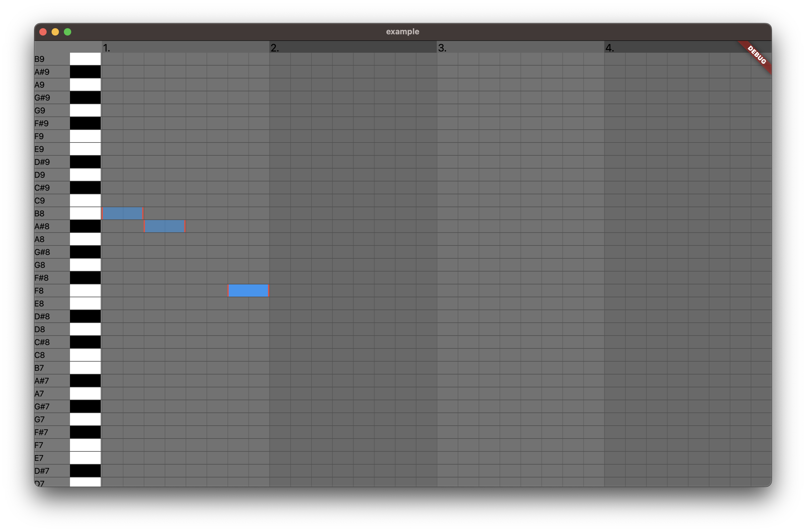

# augmented_midi_editor_flutter

A flutter piano roll view.



## Run example

```bash
git clone git@github.com:augmented-audio/augmented_midi_editor_flutter
cd augmented_midi_editor_flutter/example
flutter run
```

## Additional information

Run codegen for mobx:

```bash
flutter pub run build_runner build
```
